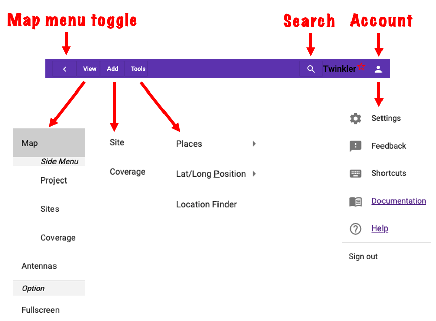
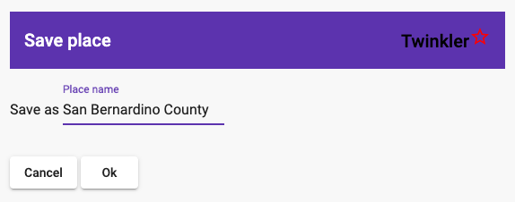
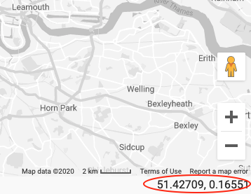
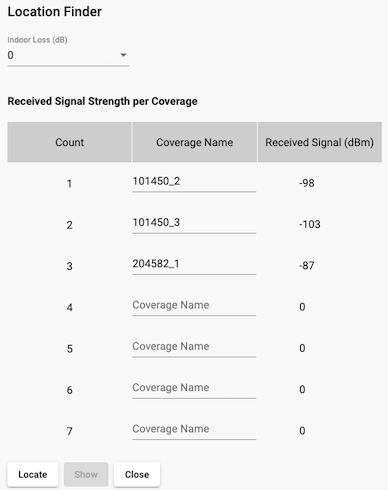
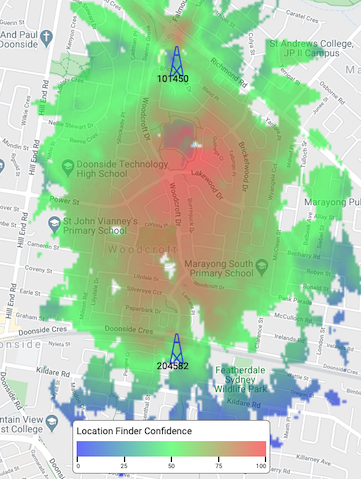
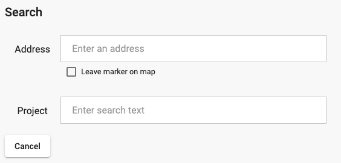
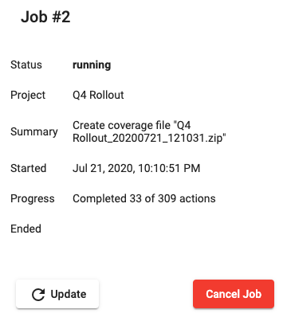
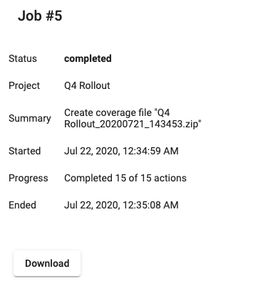
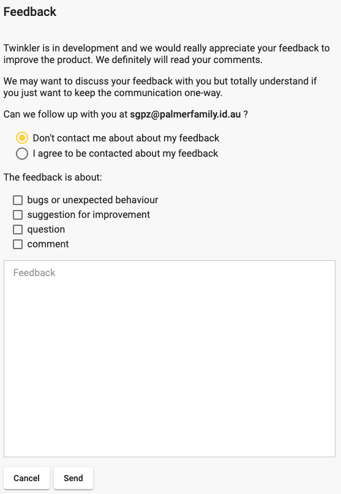
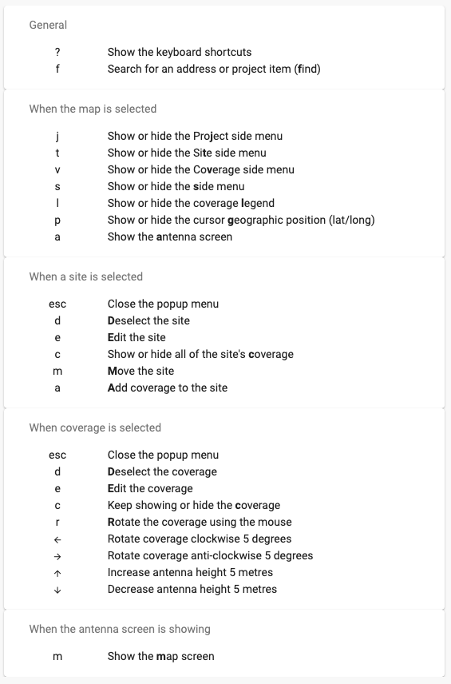

# 
# Main Menu

The Main Menus appear in the strip along the top of the Twinkler screen.

# Map Menu Toggle

Show or hide map menu panels (Project, Site and Coverage) on the left side of the screen.

# **View** Menu

## Map

Show the map, with selected sites, coverage and layers of the project. When the map is showing this menu will have additional options open the Project, Site and Coverage menus on the left side of the screen.

## Antenna

Show the [antenna management](/antennas.md) display.

## Fullscreen

Make Twinkler go to fullscreen mode. To exit fullscreen mode, select this option again or press the escape key.  

# **Add** Menu

## Site

Add a site to the map. The cursor becomes a crosshair, click the mouse (or tapping the screen on a touch display) to place the site at the mouse location. The Site panel on the left displays information for the newly created site.

Don't forget to change the site name from the default (latitude, longitude) to something more meaningful.

<!-- See <a href link="common-actions.md/#add_site_btn">Add Site</a> for an example. -->
See [Add Site](/common-actions.md?id=add_site_div) for an example.

## Coverage

Add a coverage prediction to the currently selected site. The azimuth is set to 0 (north) but all other parameters are taken from the current settings in the Coverage Menu panel. The Coverage Menu panel is displayed.

Don't forget to change the coverage name from the default ("New Signal Strength") to something more meaningful.

# **Tools** Menu

## Places

Your favourite locations are stored in the Places menu and are available across every project. The center of the map and the zoom level is saved as the place. A name is suggested for the place however that can be overriden. 

Places are deleted by selecting a place in the Delete Place option.

## Lat/Long Position

When this option is selected the longitude and latitude of the cursor is displayed in the bottom, left side of the screen.

## Location Finder

The Location Finder tool provides a map of the likely location of a receiver given the signal strength of one or more transmitters.

&nbsp;

# Search

The search dialog has two options:

* **Address** searches for an address, centers the map on the address and places a marker on it. The markers will disappear after a few seconds unless "Leave marker on map" is selected.
* **Project** searches for text in every field in the project. This includes the name, address and notes of sites and coverage.  

# **Account** Menu

## Settings

The Settings menu has a series of small panels of related functions.

### User Management

#### User Account

The User Account panel provides details about the logged in user. There are options to reset the password and delete the account.

Warning: When an account is deleted, all data is removed from Twinkler, including every project. This cannot be undone. 

#### Usage Data

The Usage Data panel has information about what the user has stored in Twinkler, including the number of projects, sites and coverage predictions.

#### Organisation selection

This panel will be present when the user is a member of at least one organisation.

The user must select what organisaton they wish to be associated with, or else use their personal account (non-organisation associated). This will determine what projects are visible to the user, and can be changed at any time during a session.  

### Background Jobs

This section has a series of five panels, representing the last five background jobs that the user has run (or is still running). Job allocation cycles through the five panels in a round robin fashion.

Each panel provides a summary of the job. If the job is still running there is an option to refresh the progress data or cancel the job.

If a job produces an output file, such as a coverage export, there is a Download button. It is important to download the file before five more background jobs are run, as each panel is overwritten on every fifth job and there is no more opportunity to download a file associated with the previous job.  

&nbsp;&nbsp;&nbsp;&nbsp;&nbsp;&nbsp;

### Organisation Management

The Organisation Management section will be available if the user is an administrator of an organisation.

#### Users in the Organisation

This panel manages users into and out-of the organisation. The email domains associated with the organisation is shown. These domains are established when the organisation is on-boarded. All email account from an associated email domain are identified and presented in one of two lists to action:

* The membership of existing users in the organisation can be removed
* Membership of non-members can be given

#### Group Management

Groups are created and deleted in this panel.

#### Group Membership

In this panel members of the organisation are added to and removed from groups. The normal sequence is that a user is selected and then two action lists are updated:

* Groups that the user can be added to
* Groups that the user can be removed from

## Feedback

The feedback form in the account menu (top right) quickly provides immediate feedback to the Twinkler team. Your feedback will always be read and we __really__ appreciate your views, positive or negative.

## Shortcuts

This option brings up a list of the keyboard shortcuts.

