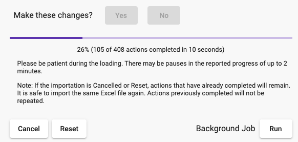

# 
# Map Menus

The Map Menus are panels on the left side of the screen that display when the map is showing. Each menu has a number of panels that can be expanded and collapsed.

The ID of the selected object is shown at the bottom of the menu, along with an option to copy the ID to the clipboard. The ID can be useful when working with an external spreadsheet (imported/exported) or when reporting an issue, such as through the feedback form.

# Project

At the bottom of the panel, in addition to the ID, the owner of the project is displayed and the access level of the current user.

## General

### Select Project

Select the project to work on. Only one project can be open at a time. The list of available projects is determined by which organisation is selected (if any), or else personal projects are displayed.

### Export Configuration

The **Export** button in *Excel Configuration File* returns an Excel file containing data from the project, including all sites and coverage parameters. The Excel file can be edited and then imported again.

### Import Configuration

The **Import** button in *Excel Configuration File* brings up a dialog box to import site and coverage data into the project.

The steps to import configuration data are:

* Check the first "No" or "Yes" option about deleting existing sites and coverage. This option determines what action is taken when sites or coverage in the project cannot be found in the configuration file. "No" causes no action to be taken - they are ignored. "Yes" causes the site or coverage to be deleted. The default is "No".
* Select the Excel file to upload
* Press the Upload button. The file is sent to Twinkler for review.
* Check the review results. Are the number of additions, changes and deletions for sites and coverage expected? Were any errors reported?
* Press Yes to start the changes
* Progress is displayed. If the importation will take some time (eg. many coverages to predict) the **Run** button will continue the task as a [background job](main-menu?id=background-jobs).   

### Export Coverage

The **Export** button in *Coverage File* returns a zip file, containing the project coverage in one of several  standard vector file formats. The coverage can then be analysed and processed outside of Twinkler using additional tools eg. [QGIS](https://qgis.org/), ArcGIS or MapInfo Professional.

There are a number of options to select:

* **Coverage Selection** Select whether to export the coverage from every site in the project or only the sites that are currently on the screen. The coverage will only be taken from the selected radio technology and coverage tags.
* **Coverage Form** There are two forms that the exported coverage can take. In the first form, 'combined' polygons are returned that represent the strongest signal strength in the coverage area but the identity of the individual contributors is lost. In the second form, every individual coverage is exported, with the coverage name included as an attribute of the polygon. This form allows polygons to overlap. 
* **Signal Strength** Combining all signal strengths ('Yes' option) produces smaller files with fewer, larger polygons. Exporting with signal strengths ('No' option) produces larger files with a greater number of smaller polygons that represent discrete signal strength (dBm) values. The size of the signal strength increment (1, 2, 5, or 10dBm) determines the size of the ouptut file.
* **Resolution** The resolution of the exported coverage can be controlled. Higher resolution (ie. smaller feature sizes) result in larger files and take longer to produce.
* **File Format** A number of standard file formats are supported - Shapefile, MapInfo TAB, MapInfo MIF, GeoPackage, GsoJSON and Keyhole Markup. Some file formats produce multiple files but in all cases the result is zipped before returning a single file.  

Progress is displayed once the save process commences. If the export will take some time the **Run** button will continue the task as a [background job](main-menu?id=background-jobs) and the file can be retrieved from the [Settings menu](main-menu?id=background-jobs).

#### KMZ Options

There are three more options for KMZ file format, due to the fact that KMZ files also contain information about how to present the coverage data eg. in Google Earth.

* **Opacity** Move the slider to control the opacity of the layer.
* **Color Scheme** Select the color scheme used to represent signal strength.
* **KMZ Tiles** The coverage is broken down into smaller 'tiles', which can be viewed individually. This may help if a viewing application, such as Google Earth, is struggling to display large or highly detailed coverage.

### Project Management

There are several options to manage projects: 

* **Rename** The project is renamed with the name provided in the textbox above. 
* **New** A new project is created with the name provided in the textbox above. The new project becomes the active project.
* **Duplicate** The active project is duplicated using the name provided in the textbox above. The duplication can be of all sites in the project or only the selected (ie. tagged) sites. Duplication includes the coverage of the copied sites. The newly created project becomes the active project.
* **Delete** The active project is deleted. Warning: all data in the project is deleted and cannot be recovered.
* **Recenter Map** Repositions the map view so that every site in the project is on the screen. This is useful to quickly regain a holistic view of the project. 

### Notes

Freeform text notes can be added to the project.

## Layers

### Import Layer

Vector files and Raster WMTS Raster Tiles can be imported as layers.

#### Vector File

The first steps to import a vector file are:

* **Layer Type** is Vector file
* **Choose file** Select a vector file to upload. Note that only a single file can be selected, so any file formats that require multiple files (eg. MapInfo, Shapefile) will have to be put into a single zip file for uploading.
* **Upload** the file to the server for analysis. This returns "Vector file details".
* **Spatial Reference System** In the event that a [Spatial Reference System](https://en.wikipedia.org/wiki/Spatial_reference_system) is not defined in the vector file, it has to be manually entered. The format is a number, defined by [EPSG](https://en.wikipedia.org/wiki/EPSG_Geodetic_Parameter_Dataset), which is an organisation with a [website](https://epsg.org/home.html) that maintains SRS defintions. Vector file details may be used as search terms on the website, to identify the correct EPSG number.

After the vector file has been analyzed the results are displayed, along with the **layer name** and four optional selections to make. The default layer name is the filename but can be changed to whatever is more suitable. 

Twinkler will store up to two text fields and two numerical fields from the vector file for each polygon. The options define which fields (if any) are to be stored. When displaying the layer the first text field is used as the **label**.

The **Confirm** button initiates the importation of the layer into Twinkler. Once it has completed the layer will selected and displayed. The default presentation style (red filled polygons, with blacks borders and labels) can be adjusted to whatever is more suitable.

#### Map Server Raster Tiles

To display a layer from a Web Map Tile Service ([WMTS](https://en.wikipedia.org/wiki/Web_Map_Tile_Service)) based on raster tiles the following information is supplied:

* **Layer Type** is Map Server Raster
* **Layer Name** for the layer
* **Tile URL** is the full URL for each tile in the service, where tile parameters in the URL are specified according to the coordinate type:
    * tile coordinates - {x}, {y}, {zoom}
    * boundary box - {west}, {south}, {east}, {north}
* **Coordinate Type** describes how tile boundaries are defined in the URL.  

### Layer Management

With multiple layers it is possible to control the order of the layers. Layers are placed on top of each other in the order in which they are enabled. To place a lower layer on the top, hide it then show it.

* **Show/Hide layer** will show/hide the selected layer  
* **Delete layer** deletes the layer
* **Show/Hide All Layers** shows/hides all defined layers
* **Light/Dark** Move this slider to control the opacity of the layer
* **Notes** Free form text notes. Map Server URLs are included in the note. 

Vector layers have additional controls enabled:

* **Point Size** The radius of points (if any)
* **Point Color** The color of points (if any)
* **Line Size** The width of lines (if any)
* **Line Color** The color of lines (if any)
* **Polygon fill color** The color that polygons are filled with (if any)
* **Label Size** The size of labels if they were defined (first text field) on layer creation. Select 'none' to not show the labels.

## Map Style

There are several options to adjust the style of the underlying base map.

* **Transportation** There are four levels of transportation - none, basic, some and all. They show successively more types of transportation elements on the map, such as roads, highways, railways and airports.
* **Annotations** Items such as areas, locations, points of interests and businesses are shown. Grouped as none, basic, some and all.
* **Coloring** The overall colors of the map are selected, with the options being default, washed out or nostalgia.

# Sites

## General

* **Show site names** Show the names of all sites under their icon on the map.

* **Sites to Display** Control which sites to display on the map. If "Tagged Sites" is selected then a box will become active in which tags can be selected, as well the the logic of combining the tags. If 'or' is selected then a site has to have at least one of the required tags present, with 'and' the site has to have all of the required tags.

* **Site Clustering** "Clustering" is when nearby sites are represented by a single icon, which has a number showing the number of sites that it represents. Clustering is normally seen when the map is zoomed out, this is the default behaviour. Clicking a cluster will zoom in to reveal sites or smaller clusters. It is possible to temporarily stop clustering however the application may slow down if too many sites are being displayed. A warning will be displayed if this is likely to occur. The options to stop clustering are:
    * *Off* - no clustering until the session ends or projects changes
    * *Off until zoom out* - no clustering until the map is zoomed out
    * *Off for on-screen sites* - no clustering for the sites that are currently displayed on the screen

&nbsp;&nbsp;

* **Recenter Map** Repositions the map view so that every site in the project is on the screen. This is useful to quickly regain a holistic view of the project.

## Individual Site

When a site is selected it's details are shown in the lower panel in the Site menu and it's icon on the map is changed to a target. The details can be edited, with changes beingg saved and taking effect immediately.

* **Changes allowed** Determines whether the site can be changed, or is read-only. 
* **Site Name** The name of the site.
* **Icon** The icon used to represent the site on the map. Note that when the icon is changed the site will cease to be selected, so that the new icon can be seen.
* **Color** The color of the site icon.
* **Include in clusters** When this is turned on the site will be grouped into clusters when the map is zoomed out. When a new site is created this is turned off so that the new site remains visible even if there are other sites around it. After another site is selected however this is turned on in the new site.
* **Tags** The tags associated with the site. All tags are displayed. Selected tags are green, unselected tags are red.
* **Longitude** The decimal longitude (x-axis) of the site.
* **Latitude** The decimal latitude (x-axis) of the site.
* **Address** The street address of the site (optional)
* **External ID** External identification of the site (optional). The external ID can be useful during importing by allowing site parameters to be manipulated in a spreadsheet eg. with a "lookup" function into another spreadsheet. 
* **Notes** Freeform text notes can be added to the site (optional).

# Coverage

## General

* **Show coverage names** Show the coverage name when the coverage icon is showing.
* **Show legend** Show the legend on the map
* **Export** Export project coverage to a file. See [above](#export-coverage) for more details.
* **Coverage to display** Control which coverage to display on the map. This applies to individual coverage as well as combined coverage. If "Tagged Coverage" is selected then a box will become active in which tags can be selected, as well the the logic of combining the tags. If 'or' is selected then a coverage has to have at least one of the required tags present, with 'and' the coverage has to have all of the required tags.

## Combined Coverage

* **Show combined coverage** Show combined coverage on the map.
* **Radio Technology** Select the Radio Technology to show.
* **Opacity** Move the slider to control the opacity of the layer.
* **Threshold** Move the slider to control the limit at which coverage is displayed. Moving to the right increases the limit and therefore shows less of the coverage, which can be used to simulate effects eg. more interference or indoor coverage. 
* **Color Scheme** Select the color scheme used to represent signal strength. The legend will also be updated when this is changed.

## Individual Coverage

* **Coverage Name** The name of the coverage.
* **Changes allowed** Determines whether the coverage can be changed, or is read-only. 
* **External ID** External identification of the coverage (optional). The external ID can be useful during importing by allowing coverage parameters to be manipulated in a spreadsheet eg. with a "lookup" function into another spreadsheet.
* **Notes** Freeform text notes can be added to the coverage (optional).

### Transmitting Antenna

* **Model** Select a transmitting antenna model from the list or select one by pressed the arrow/screen icon on the right. The list shows:
  * *Feasible Antennas* - compatible with the selected frequncy band
  * *Favorite Antennas* - antennas previously added as a favorites 
  * *Project Antennas* - antennas that are used in the project
* **Height** The height of the transmitting antenna above ground (metres)
* **Azimuth** The azimuth angle of the antenna. 0 is north, 90 east, 180 south and 270 west.
* **Tilt** The elevation (tilt) angle of the antenna below the horizontal. This value can range from -90 (facing the ground) to +90 (facing the sky) but most usually will be somewhere between 0 (horizontal) and less than 10 (tilting slightly downwards).
* **More Antennas** Open [Antenna Management](/antennas.md) display.

### Radio System

* **Radio Technology** Select the radio technology to predict.
* **Coverage Type** Select the coverage type that is applicable to the selected radio technology.
* **Frequency Band** Select a band that has been standardised for the selected radio technology. 
* **Show indoor coverage** Apply the indoor_loss parameter value to the radio link. This has the effect of displaying the signal strength that would be recieved whilst indoors.
* **More Configuration** Opens a dialog where more detailed radio configuration parameters can be supplied. See [Radio System](/parameters?id=radio-system) for more information about the parameters. 

### Display Options

* **Values Displayed** Select what values in respect of the coverage prediction to display. The options are:
  * *Signal Strength* (default) The signal strength in dBm, represented in 1 dBm increments. 
  * *Signal Strength 3-level* The signal strength in dBm, divided into three levels.
  * *Throughput* An approximation of the maximum throughput in Mbps that could be received with the selected radio technology in the coverage area.
  * *Throughput 3-level* An approximation of the maximum throughput in Mbps that could be received with the selected radio technology, divided into three levels.
  * *Line of Sight* An indication whether there is an unobstructed path (line of sight) from the transmitting antenna to any receiving antenna around the transmitter.
  * *Ground Elevation* The height of the ground above sea level around the transmitter.
  * *Morphology* The morphology defintions around the transmitter used in the COSTHata propagation model. 
  * *Diffration Loss* The loss (in dB) caused by diffraction from the transmitter to any receiving antenna around the transmitter.
  * *Tx Antenna Gain* The total antenna gain or loss around the antenna (relative to an [isotropic antenna](https://en.wikipedia.org/wiki/Antenna_types#Isotropic)) taking into account the horizontal and vertical patterns as well as the height above ground of the transmitter and receiver.
  * *Tx Antenna Azimuth Pattern* The gain or loss around the antenna due to the horizontal radiation pattern.
  * *Tx Antenna Elevation Pattern* The gain or loss around the antenna due to the vertical radiation pattern.
  * *Path Loss* The path loss from the transmitter for the selected propagation model. 
* **Pixel Height** The approximate height of each pixel in the coverage prediction ie. the resolution.
* **Do not show coverage over water** Do not show coverage where it is over any water bodies (oceans, seas, lakes etc)
* **Opacity** Move the slider to control the opacity of the coverage.
* **Focus** A number from 0 (no smoothing) to 10 that determines how much the coverage values are blended or smoothed.
* **Color Scheme** Select the color scheme used to represent signal strength. The legend will also be updated when this is changed.

### Tags

The tags associated with the coverage. All tags are displayed. Selected tags are green, unselected tags are red.

